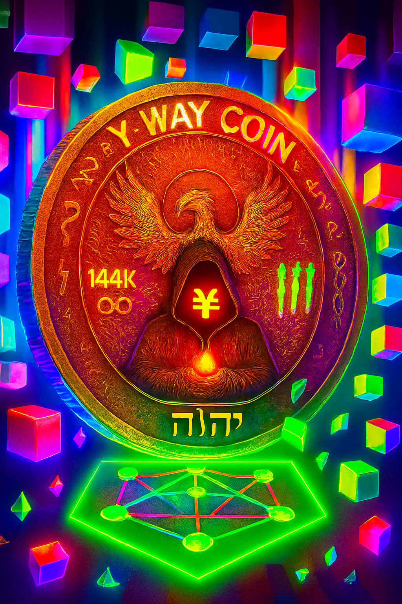

  

# PHEOINXYCoinTOKENList
PHOENIXY-Coin
## 🧬 Glyph Hashes

- **Phoenixy Glyph (SHA256):** `0x...`  
- **Vitruvian Glyph (SHA256):** `0xD3205DA0BFD3BEAF9E30787269A78B80CDAFBC96A115C71EFFDEC792EBA36144`
