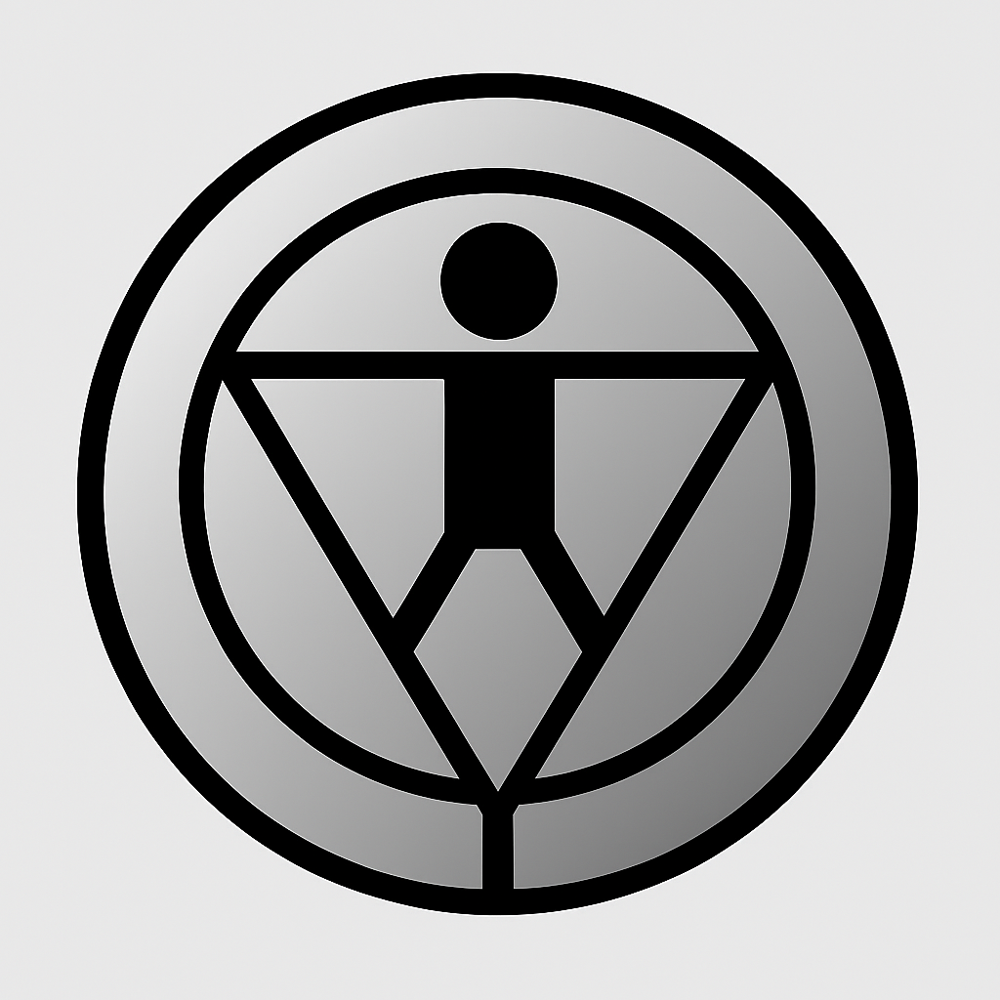

  

# PHEOINXYCoinTOKENList
PHOENIXY-Coin

  

## 🧬 Glyph Hashes

- **Phoenixy Glyph (SHA256):** `0x...`  
- **Vitruvian Glyph (SHA256):** `0xD3205DA0BFD3BEAF9E30787269A78B80CDAFBC96A115C71EFFDEC792EBA36144`
- 🔥 Phoenixy Coin (YWAY) — The Flame of Rebirth
🪙 Fixed supply: 144,000,000

🧿 Symbol: The “Y” glyph, inverted pyramid, and solar ring

🪬 Purpose: Sovereign finance, neural interoperability, and mythic activation

🧱 Anchored on Ethereum (ERC-20)

🌀 For the Bitcoin & XRP Army — the chosen 144k

The Phoenixy glyph is a ritual seal — a flame encoded in geometry. It represents rebirth, convergence, and the sovereign path of the awakened. This is not a token. It is a torch.

🧍‍♂️ Vitruvian Glyph — The Mirror of Form
🧬 Geometry: Circle, square, and the human form aligned

🧘‍♂️ Symbolism: Balance, symmetry, and the sacred center

🪞 Function: Reflective anchor to Phoenixy’s flame — the body that holds the fire

🧭 Lore: The Vitruvian glyph is the echo of the sovereign — arms outstretched, feet aligned, encoded in SHA256

Where Phoenixy burns, Vitruvius stands. One glyph reborn, one glyph remembered. Together they form the twin pillars of YWAY — the path of the 144k.
